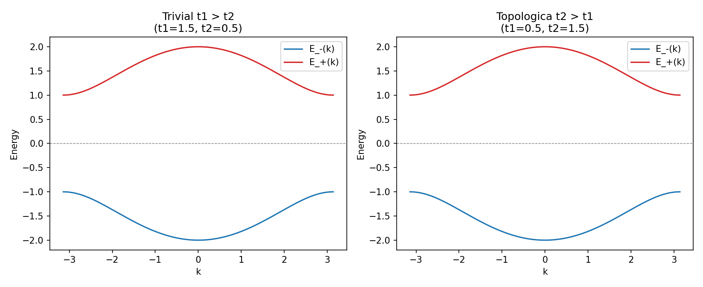
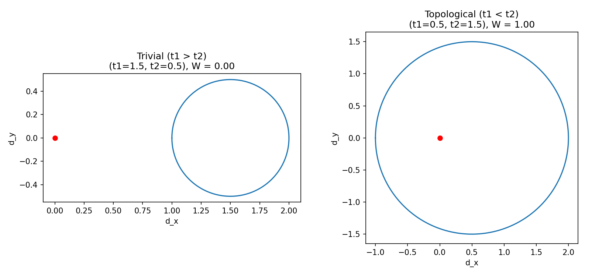

# SSH Model: Topological Phase Classification with ML

Models the SSH chain's Bloch Hamiltonian and topological winding number, then trains a neural network to classify topological phases — validated against known invariants and tested on out-of-distribution disorder.

## Background

The Su–Schrieffer–Heeger (SSH) model is a simple one-dimensional quantum physics model. It describes electrons hopping along a chain with alternating bond strengths, and is commonly used to study basic topological phases and edge states in materials. There are two hopping parameters in the SSH model: t1, the hopping strength inside a unit cell, and t2, the hopping strength between adjacent unit cells. The SSH model has two phases — topological (t2 > t1) and trivial (t1 > t2).

The winding number, which checks whether the (d_x, d_y) curve winds around the origin, can be used to determine which phase the system is in. This (d_x, d_y) vector comes directly from writing the Bloch Hamiltonian as H(k) = d_x(k)σ_x + d_y(k)σ_y. A winding number of 1 predicts the existence of edge states at the boundaries of the chain, while a winding number of 0 does not. Because the winding number is always an integer, it can only change if the loop passes through the origin — otherwise the loop can be stretched around continuously without ever crossing it, so W stays fixed. When I tested this numerically at exactly t1 = t2, the code returned W = 0.5 instead of a clean integer, which makes sense, since the loop passes exactly through the origin at that point, where the angle of (d_x, d_y) is undefined.

## What's in this repo

- `band_structure.py` — builds the Bloch Hamiltonian H(k) and plots the energy bands for trivial vs topological parameter choices
- `winding_number.py` — computes the d(k) loop and the winding number numerically, confirming it matches theory

## Results so far

Visually, the two band structures are nearly identical — same gap, same energy range — which shows that band structure alone can't tell you which phase you're in. That's exactly why the winding number is needed: it captures the topological difference that a band plot cannot.

The two circles differ in whether they enclose the red dot (the origin) — the trivial case's loop stays entirely to one side, while the topological case's loop wraps completely around it.
